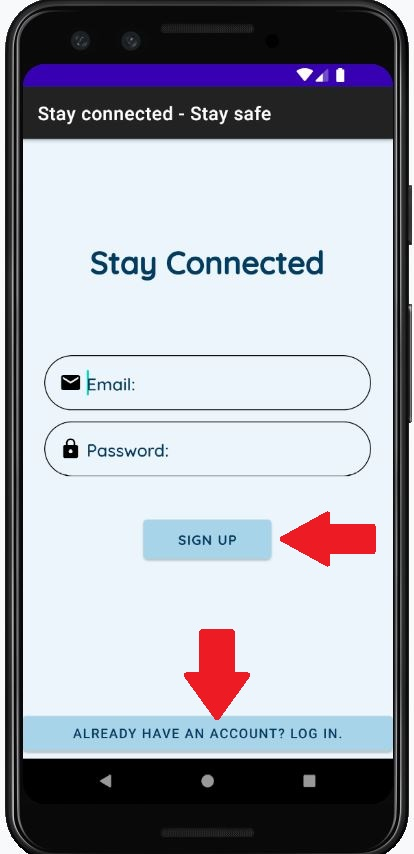
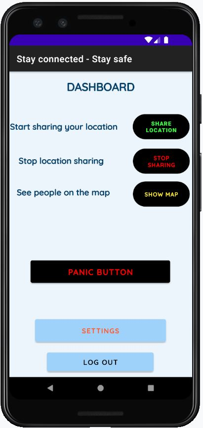
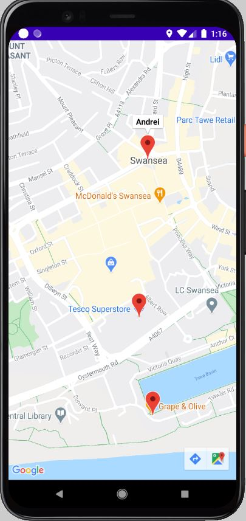
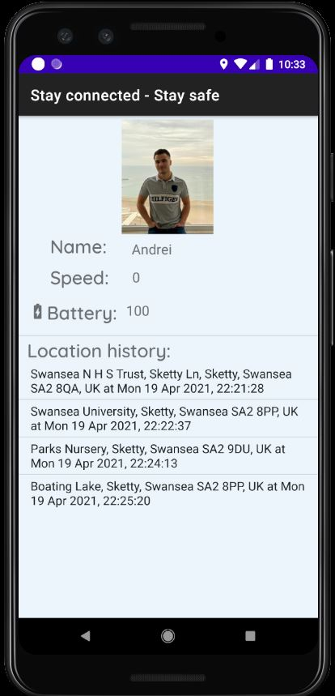
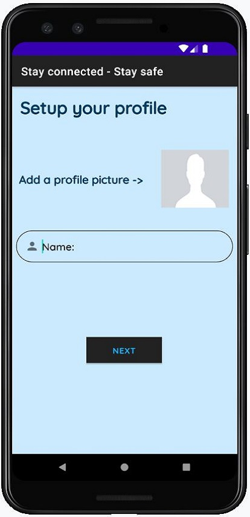
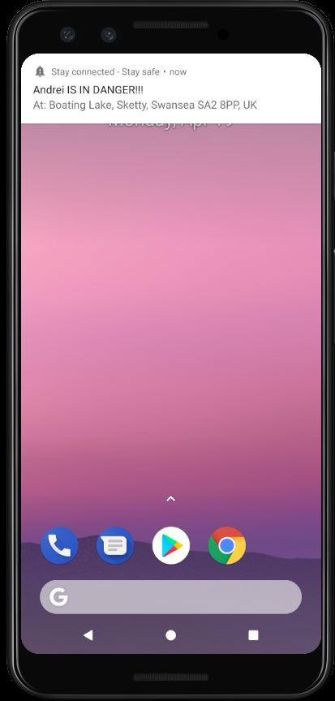
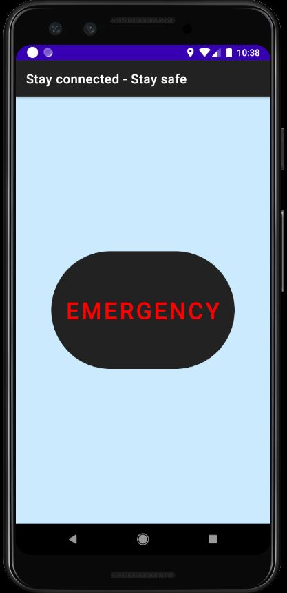

# Stay-Connected-Stay-Safe
<b>An Android Application designed to enhance the safety of those who use it by presenting real-time user location information to connected persons on a map.</b>
<b>Read about this project in details here:  </b>

<b>User sign up:</b>                   

  <b>Dashboard:</b> 

<b>Users on map:</b>

 <b>Detailed profile:</b> 

<b>Setup profile:</b>

 <b>Notification:</b> 

<b>Emergency button:</b>

